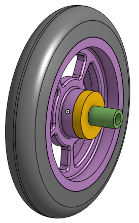
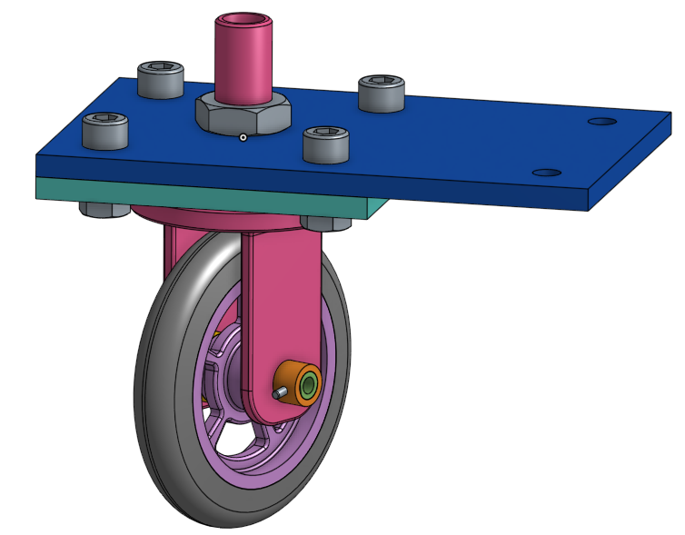
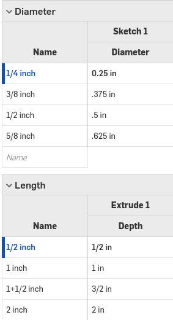
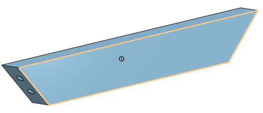
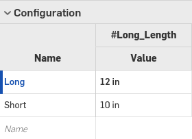
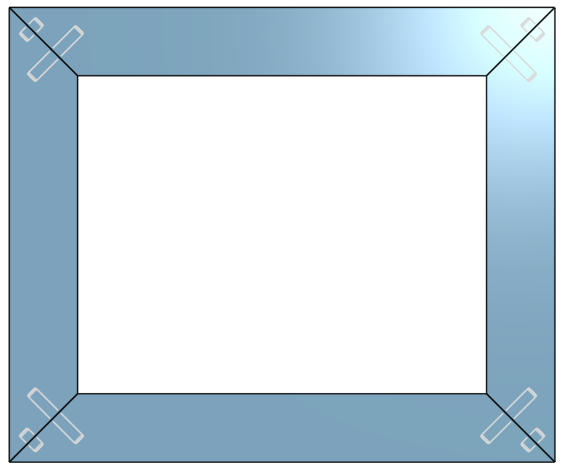

# Basic_Onshape_CAD
## Caster
### Base
This piece was pretty easy to make. I had some trouble with trying to pattern the circles because it was patterning the whole part not just the circles but I figured out that I had to change it to just pattern the features. 

### Mount
This was a super quick piece to make. Being able to sketch the square, the circles, and pattern the for circles in the corner all in one sketch was really nice.

### Fork
This was a more complex piece but overall was really easy to navigate and so far I'm really liking Onshape.

### Tire
This was a super fast assignment. It was great to learn how to revolve.

### Wheel
This one took me a bit longer because I was having trouble with creating the cutouts so I had to restart the sketch.

### Axle, Collar, and Bearings
These pieces were quick and were good practice creating new parts in the same part studio.

  

### Sub Assembly
I had some trouble with this assembly because some of the mate connecters were a little off center so I had to make sure I choose the right one or the parts wouldn't line up. 

### Assembly
This was overall really fun to do. Onshape makes mates super easy so it doesn't take aslong to put each part together. I also really like how putting hardware in works. Being able to click on each spot and then insert them is great. I really enjoyed making this and was surprised at how fast I adjusted to Onshape and was able to make the parts.

## Dowel Pins
This assignment we learned to use configurations and I found out how to use equations/variables on OnShape. I was having some trouble before I used the variable because the short side of the frame piece wouldn't shorten with the long side. After I figured out the variables it was super easy and fast. 

### Pictures
Dowel:

Dowel Configurations:

Frame Side:

Frame Configurations:

Frame Assembly:

