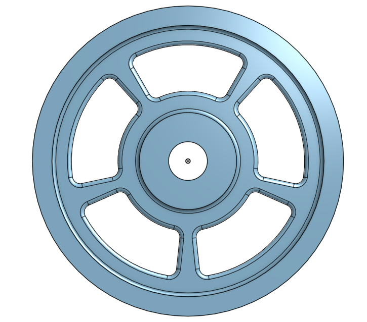

# Basic_Onshape_CAD

## Base
This piece was pretty easy to make. I had some trouble with trying to pattern the circles because it was patterning the whole part not just the circles but I figured out that I had to change it to just pattern the features. 

## Mount
This was a super quick piece to make. Being able to sketch the square, the circles, and pattern the for circles in the corner all in one sketch was really nice.

## Fork
This was a more complex piece but overall was really easy to navigate and so far I'm really liking Onshape.

## Tire
This was a super fast assignment. It was great to learn how to revolve.

## Wheel
This one took me a bit longer because I was having trouble with creating the cutouts so I had to restart the sketch.

## Axle, Collar, and Bearings
These pieces were quick and were good practice creating new parts in the same part studio.

  
